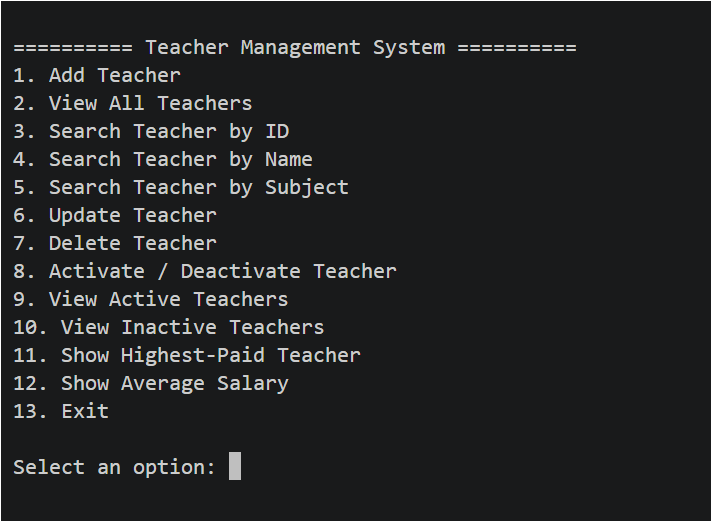

# Teacher Management System

A beginner-level Teacher Management System built with **Python** and **PostgreSQL**.

This project is a menu-driven console application that allows users to manage teacher records through a PostgreSQL database.

## Features

* Add a new teacher
* View all teachers
* Search teachers by ID
* Search teachers by name
* Search teachers by subject
* Update teacher information
* Delete teacher records
* Change teacher status between active and inactive
* Find the highest-paid teacher
* Calculate the average salary
* Store teacher data in a PostgreSQL database

## Technologies Used

* Python
* PostgreSQL
* SQL
* psycopg

## Project Structure

```text
Teacher-Management-System/
│
├── postgreSQL/
│   └── teacher_management.py
│
├── schema.sql
├── README.md
├── .gitignore
├── .env.example
└── screenshot.png
```

## How to Run

### 1. Install Python

Make sure Python is installed on your computer.

Check it with:

```bash
python --version
```

### 2. Install the PostgreSQL Python library

Run:

```bash
pip install psycopg
```

### 3. Create the database

Create a PostgreSQL database, for example:

```text
teacher_management
```

### 4. Create the tables

Run the SQL commands from:

```text
schema.sql
```

You can run the file using pgAdmin or the PostgreSQL command line.

### 5. Configure the database connection

Create a `.env` file in the main project folder and add your own database credentials.

Example:

```env
DB_NAME=teacher_management
DB_USER=postgres
DB_PASSWORD=your_password
DB_HOST=localhost
DB_PORT=5432
```

Do not upload the `.env` file to GitHub.

### 6. Run the Python program

From the project folder, run:

```bash
python postgreSQL/teacher_management.py
```

## Example

The program starts with a menu that allows the user to select different teacher management operations.



## What I Learned

This project helped me practice:

* Connecting Python with PostgreSQL
* Writing SQL queries
* Creating and managing database tables
* Using `INSERT`, `SELECT`, `UPDATE`, and `DELETE`
* Searching database records
* Using SQL conditions and filtering
* Working with PostgreSQL from Python
* Using Python functions and loops
* Handling user input
* Using Git and GitHub to manage a project
* Protecting database credentials with environment variables

## Project Level

This is one of my early projects while learning **Python, SQL, and PostgreSQL**. It was created for learning and practice purposes.
